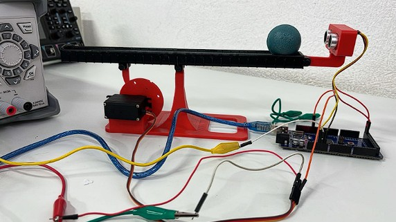
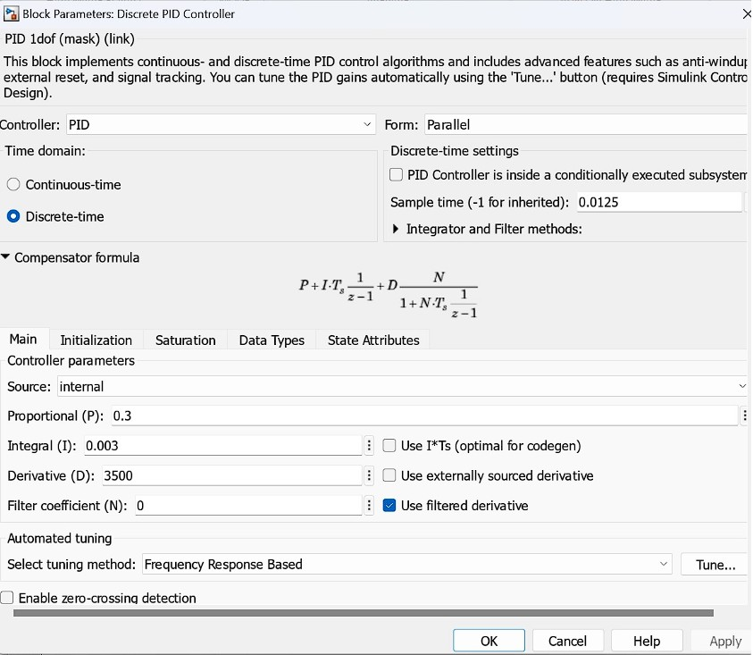
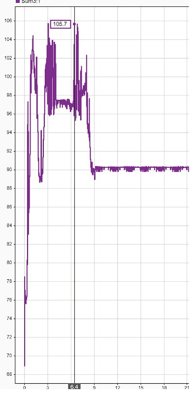
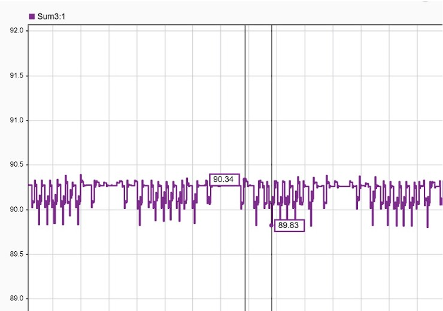

# Ball & Beam Digital Control System

Design and physical implementation of a discrete-time PID controller to stabilize a ball at the center of a beam. The system was modeled from first principles using Lagrangian mechanics, discretized using the Tustin method in MATLAB, and deployed in real-time via Simulink on an Arduino Mega 2560. **All three design criteria were met.**

🎥 [Watch demo video](https://youtu.be/nYlPaQfD3vw?si=VAB0bLlS5XqF4pD0)

---

## Results

| Design Criterion | Target | Achieved | Status |
|---|---|---|---|
| Overshoot | < 20% | 17.44% | ✅ |
| Settling time | < 10 s | 9.4 s | ✅ |
| Steady-state error | < 3% | < 0.6% (89.83°–90.34°) | ✅ |

---

## System Overview

The Ball & Beam is a classic unstable control system — a ball rolls freely along a beam whose angle is controlled by a servo motor. The controller must continuously adjust the beam angle to keep the ball at a desired position (beam center) regardless of initial position or disturbances.

---

## Hardware

| Component | Specification |
|---|---|
| Microcontroller | Arduino Mega 2560 |
| Actuator | Servo MG-995 (PWM, 4.8–6V) |
| Position sensor | HC-SR04 ultrasonic (40 Hz sampling) |
| Beam | 3D printed PLA, 28 cm length |
| Ball | Plastic, mass 1.52 g, radius 36.6 mm |
| Lever arm | 3D printed PLA, 24.75 mm from servo center |

---

## Mathematical Model

### Physical Parameters

| Parameter | Symbol | Value |
|---|---|---|
| Ball mass | m | 0.00152 kg |
| Ball radius | r | 0.0366 m |
| Beam length | L | 0.28 m |
| Lever arm distance | d | 0.02475 m |
| Ball moment of inertia | J | 6.207 × 10⁻⁷ kg·m² |
| Gravity | g | 9.81 m/s² |

### Transfer Function (Continuous Domain)

Derived via Lagrangian mechanics (Euler-Lagrange equation), linearized around the horizontal equilibrium point (α ≈ 0):

```
P(s) = R(s)/θ(s) = (-mgd/L) / ((J/r² + m)·s²)
```

### Discretization

- **Method:** Tustin (bilinear transform) — preserves stability from continuous to discrete domain, no sampling delay
- **Sampling frequency:** 40 Hz (HC-SR04 sensor limit) → Nyquist: 80 Hz → **T = 0.0125 s**
- **Stability check:** Both poles at z = 1 (marginally stable → closed-loop feedback required)

**Discrete transfer function:**
```
Gz = (1.661e-05 z² + 3.323e-05 z + 1.661e-05) / (z² - 2z + 1)
```

---

## Controller Design

Discrete-time PID controller implemented in Simulink (parallel form):

| Gain | Value | Role |
|---|---|---|
| Kp | 0.3 | Ball position — drives ball across beam |
| Ki | 0.003 | Smooths motion, reduces steady-state error |
| Kd | 3500 | Ball velocity — fast response near setpoint, slow far away |

**Setpoint:** 0.135 m (beam center)  
**Servo output conversion:** `angle = -472.4409 × PID_output + 90°`  
**Equilibrium position:** 90° (horizontal beam)

### Control Loop (Simulink Block Diagram)

```
HC-SR04 → Moving Average filter → error (setpoint - position)
       → Discrete PID(z) → z⁻¹ feedback → servo output conversion
       → MG-995 Servo (PWM via Arduino Mega)
```

---

## Photos

| | |
|---|---|
|  |  |
|  |  |

---

## Files

```
ball-and-beam-digital-control/
├── simulation/
│   └── (Simulink .slx model files)
├── matlab/
│   └── (MATLAB .m script — transfer function + discretization)
├── docs/
│   └── ProyectoFinal_ControlDigital.pdf
├── images/
└── README.md
```

### Requirements to run the simulation

- MATLAB R2023 or later with Simulink
- Simulink Support Package for Arduino Hardware
- Digital Signal Processing Toolbox
- Arduino Mega 2560 with HC-SR04 and MG-995 connected

---

## Author

**Alonso Lopez Hernandez** — Mechatronics Engineer  
[LinkedIn](https://www.linkedin.com/in/alonso-lópez-hernández-10335716a) · [GitHub](https://github.com/AlonsoLohe)
